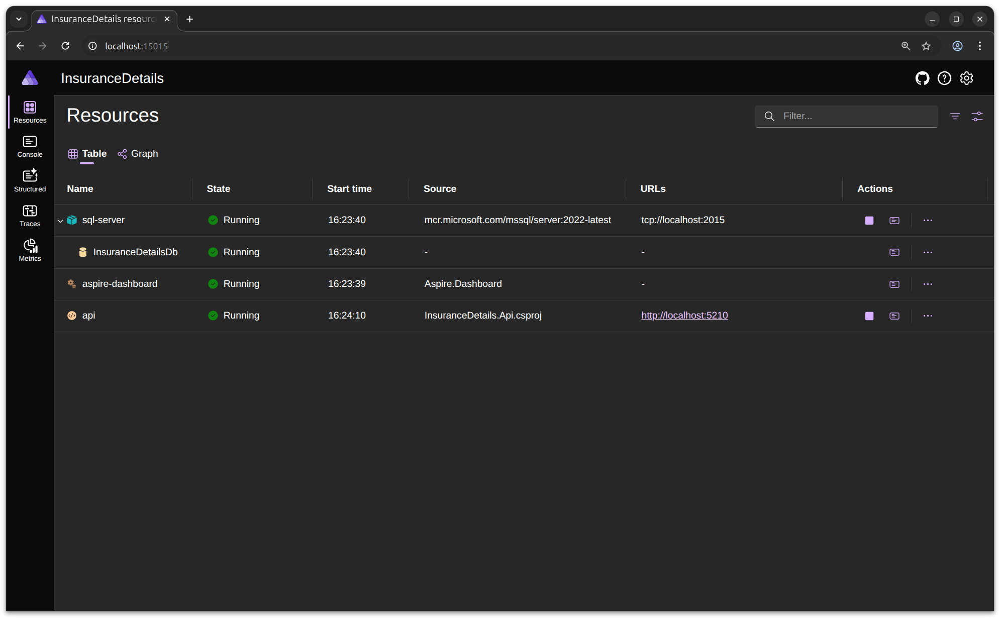
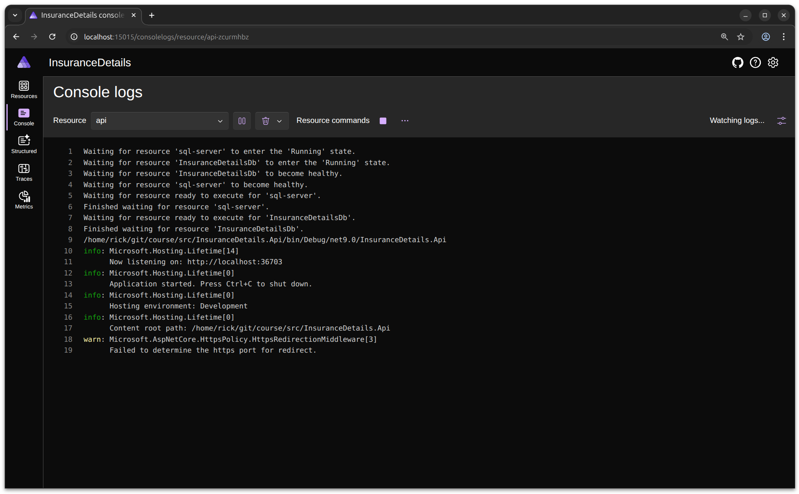
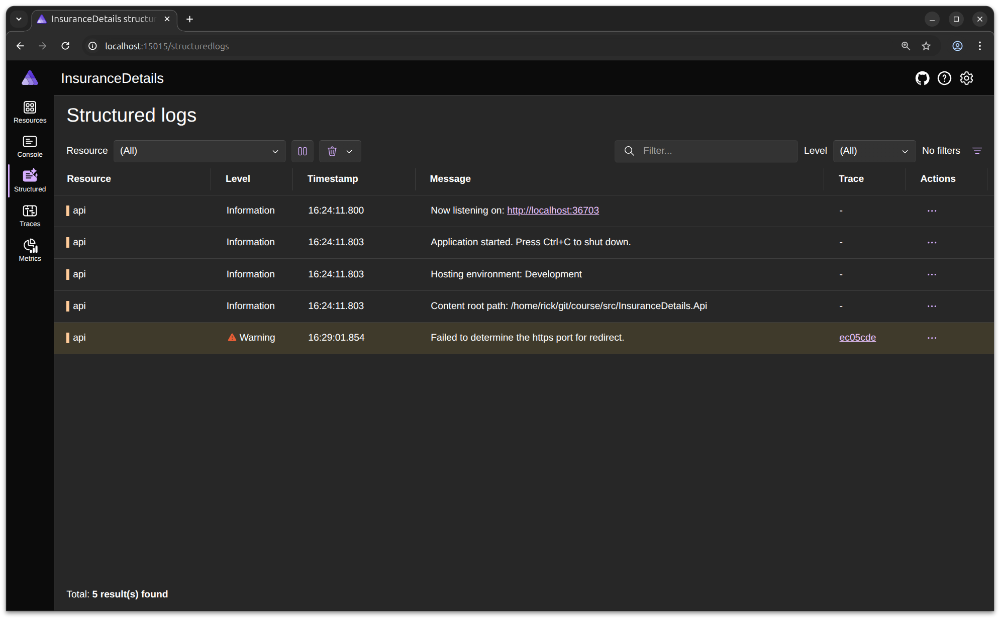
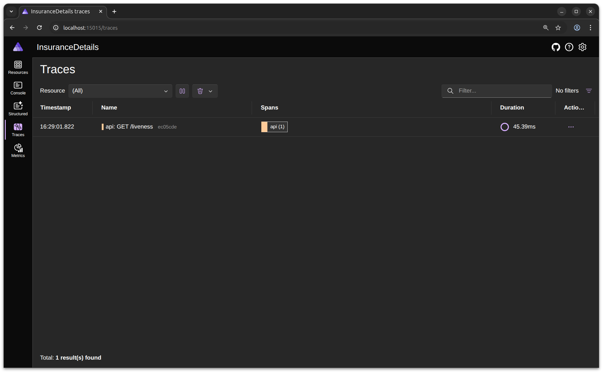
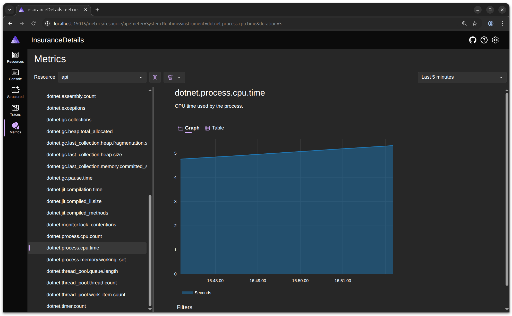

# Dashboard
Let's zoom in on the Aspire Dashboard.

## Resources

The Resources section of the Aspire Dashboard displays all the services and dependencies that are part of your distributed application. This includes APIs, databases, message queues, and other resources. You can view the status of each resource, see if they are healthy, and access useful links such as endpoints and dashboards. This section allows you to monitor and manage the lifecycle of your application's components.

## Console (logs)

The Console (logs) section shows real-time logs from your running services. You can use this view to monitor application output, debug issues, and track the behavior of your services as they run. It provides a centralized place to see logs from all components in your Aspire solution.

## Structured Log

The Structured Log section displays logs in a structured format, making it easier to filter, search, and analyze log entries. This helps you quickly identify issues, correlate events across services, and gain insights into the application's behavior.

## Tracing

The Tracing section visualizes distributed traces across your application's services. It helps you understand how requests flow through your system, measure performance, and identify bottlenecks or failures in the request path.

## Metrics

The Metrics section presents key performance indicators and resource usage statistics for your application. You can monitor CPU, memory, request rates, error rates, and other important metrics to ensure your application is running smoothly and efficiently.

