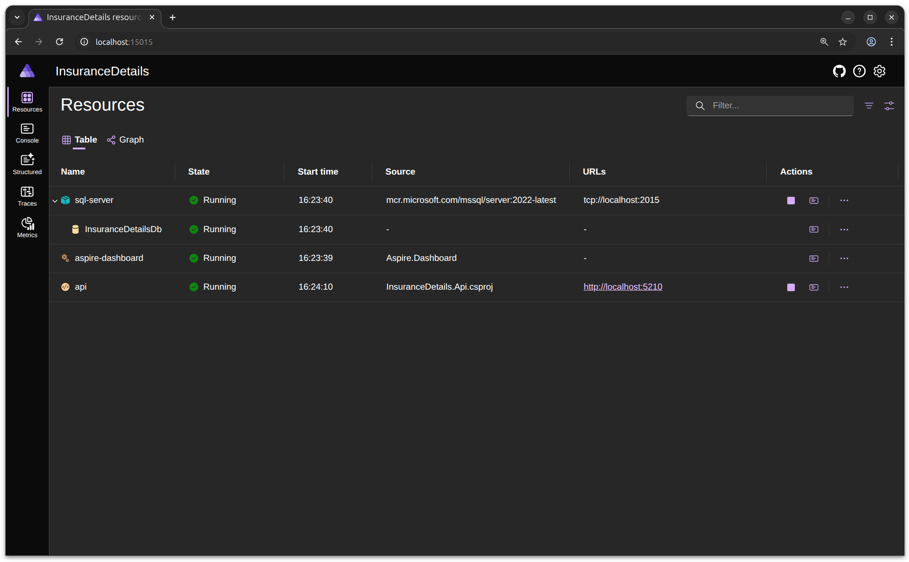

# Dependencies
Dependencies in .NET Aspire come from a wide range of built-in and community-supported resources that can be easily integrated into your distributed application. Aspire provides templates and tooling to add common dependencies such as databases, message queues, caches, and external services. There are many available dependencies, allowing you to tailor your solution to your needs.

In this workshop, we are not using SQL Server as a dependency, but Aspire supports adding SQL Server and many other services with minimal configuration. This flexibility makes it easy to extend your application with the resources you require.

## Adding SQL Server Dependency
In the previous section, we added the API project to our Aspire AppHost project.

Add the following NuGet package to the AppHost project:

```bash
dotnet add package Aspire.Hosting.SqlServer --version 9.3.0
```

Replace the code in `program.cs` of the AppHost with the following:

```csharp
var builder = DistributedApplication.CreateBuilder(args);

var sqlServer = builder
    .AddSqlServer("sql-server", port: 2015)
    .WithDataVolume("workshop")
    .WithLifetime(ContainerLifetime.Persistent);

var apiDatabase = sqlServer
    .AddDatabase("InsuranceDetailsDb");

builder
    .AddProject<Projects.InsuranceDetails_Api>("api")
    .WithReference(apiDatabase)
    .WaitFor(apiDatabase);

builder.Build().Run();
``` 

`AddSqlServer` instructs Aspire to create a SQL Server instance.

`WithDataVolume("workshop")` ensures that the SQL Server container uses a named data volume called `workshop` to persist its data. This means your database data will survive container restarts or recreations.

`WithLifetime(ContainerLifetime.Persistent)` sets the container's lifetime to persistent, so the SQL Server container will not be automatically removed when the application stops. This is useful for keeping your data and container state between runs.

In our API project, we use `WithReference` to link the SQL database, making the connection string available as an environment variable. The `WaitFor` method instructs Aspire to wait for the database to become healthy before starting our API project.

The Aspire Dashboard will appear as shown below:


## What happened
Let's see what has happened. The `AddSqlServer` method will spin up a SQL Server Docker image. You can validate this by running the following terminal command:

```
docker ps
```


Our API project is hosted within Aspire. We can validate its health status using Postman. First, update the `baseURL` variable to match the URL listed in Aspire. Then, use Postman to check the liveness and readiness health endpoints.