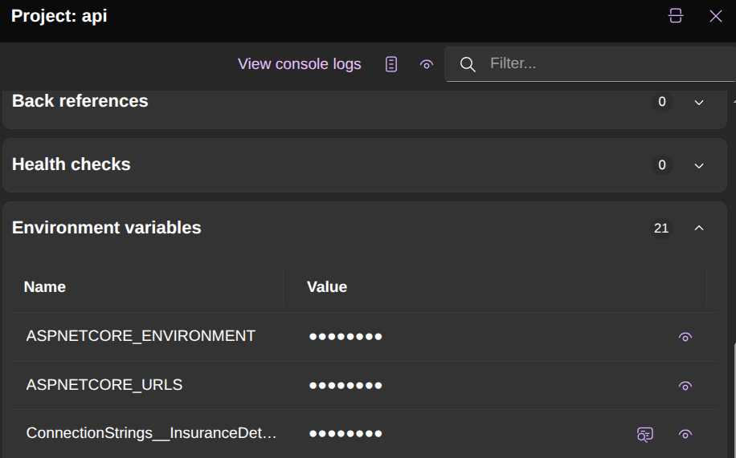
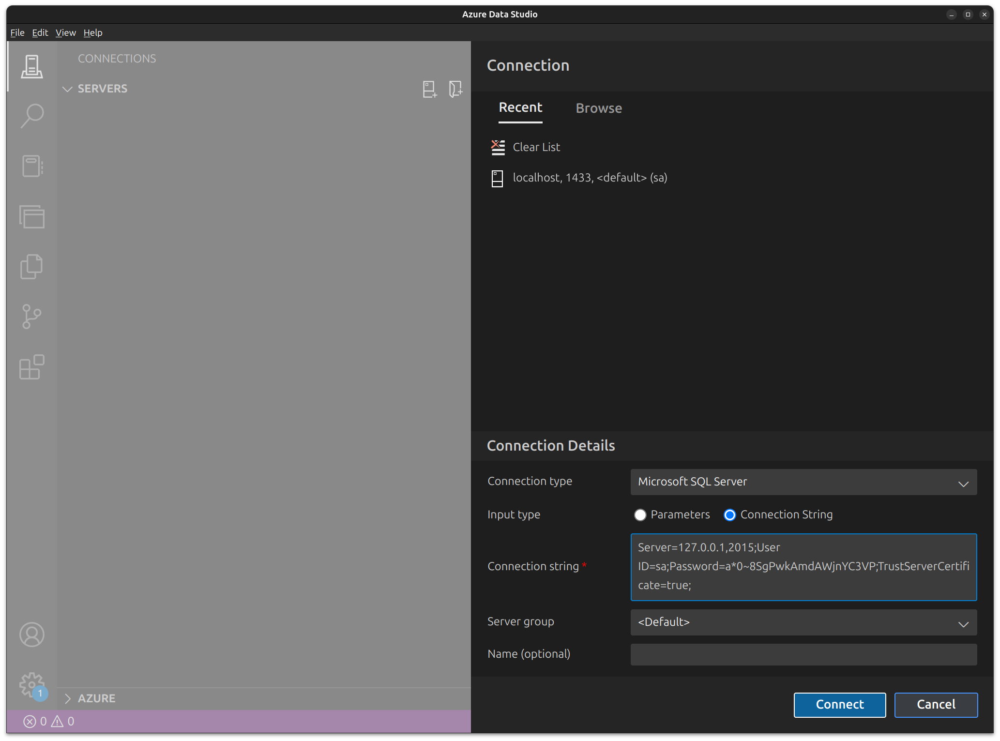

# Identity Provider

In this section, we will learn how to separate responsibilities in our application by introducing an Identity Provider. In real-world scenarios, authentication is typically handled by an external service, such as [Azure Entra ID](https://www.microsoft.com/en-us/security/business/identity-access/microsoft-entra-id), [AWS IAM](https://aws.amazon.com/iam/), or even a solution like DigiD.

## Step 1: Add a Database for Identity

Let's start by adding a new database to our Aspire application for identity management.  
Add the following code to your Aspire configuration:

```csharp
var identityDatabase = sqlServer
    .AddDatabase("IdentityDb");
```

## Step 2: Connect to the Database

Next, open a database management tool such as Azure Data Studio to inspect your SQL Server instance.

1. In Aspire, locate the resource for your SQL Server.
2. Copy the connection string from the environment setting, specifically the value for `ConnectionStrings__InsuranceDetailsDb`.  
   **Note:** Exclude the `InitialCatalog` part from the connection string.



3. In Azure Data Studio, paste the connection string into the `New connection` dialog and click `Connect`.



## Step 3: Verify the Database

Once connected, you should see the databases listed, including the new `IdentityDb`. You can now view and manage tables within this database.

## Step 4: Create a New Web Application

Now, let's separate the identity logic from the main API project by creating a dedicated web application for identity management.

- Create a new Web API application in your solution and name it `InsuranceDetails.Api.IdentityProvider`.

{: .highlight }
> This may seem counterintuitive but create the new web application **without authentication**.

## Step 5: Move Identity-Related Code

- Add a reference to the `ServiceDefault` project 
- NuGet packages
```bash
dotnet add package Microsoft.EntityFrameworkCore.SqlServer
dotnet add package Konscious.Security.Cryptography.Argon2
dotnet add package Microsoft.AspNetCore.Authentication.JwtBearer
```
- Copy the content of the `appsettings` from the API to the new project
- Move the content of the `IdentityProvider` folder to the new project
- Add a new folder `Database` to the project and copy `AppDbContext.cs`, `User.cs`, `sql-create.sql` and `DatabaseInitialisation` files from the API to the new folder
- In `AppDbContext.cs` remove everything except code that has something to do with `User`
- Replace the content of the `sql-create.sql` script with the following:
```sql
IF NOT EXISTS (SELECT * FROM sysobjects WHERE name='User')
CREATE TABLE [User] (
    Id INT PRIMARY KEY IDENTITY(1,1),
    Name NVARCHAR(MAX) NOT NULL,
    Email NVARCHAR(MAX) NOT NULL,
    PasswordHash NVARCHAR(MAX) NOT NULL,
    Salt VARBINARY(MAX) NOT NULL
);
```
- Replace the content of program.cs with the following code:

```csharp
using InsuranceDetails.Api.Database;
using InsuranceDetails.Api.IdentityProvider;
using InsuranceDetails.Api.IdentityProvider.Database;
using Microsoft.EntityFrameworkCore;

var builder = WebApplication.CreateBuilder(args);
builder.AddServiceDefaults();

var connectionString = builder.Configuration.GetConnectionString("InsuranceDetailsDb") ?? 
                       throw new InvalidOperationException("No connection string configured");

DatabaseInitialisation.CreateTheDatabase(connectionString, "InsuranceDetails.Api.IdentityProvider.Database.sql-create.sql");

builder.Services
    .AddDbContext<AppDbContext>(options => options.UseSqlServer(connectionString))
    .AddIdentityProviderServices(builder.Configuration);

var app = builder.Build();
app.MapDefaultEndpoints();

app.MapIdentityProviderEndpoints();

app.UseHttpsRedirection();

app.Run();

```

## Step 6: Clean up API project
Let clean up the API project

- In `Database\AppDbContext` and `Database\sql-create.sql` remove code specfic to users
- Delete the `Database\user.cs` file
- In `program.cs` remove the line that do not compile

## Step 6: Add the project to Aspire and apply Aspire to the project

Register your new Identity Provider project in your Aspire AppHost project. Add the following code to that program.cs file in the app host

```csharp
builder
    .AddProject<Projects.InsuranceDetails_Api_IdentityProvider>("idp")
    .WithReference(identityDatabase)
    .WaitFor(identityDatabase);
```

## Step 7: Test the connection

Verify that everything keeps running in Postman. Make sure to use the correct URL when connection to the identity provider.
