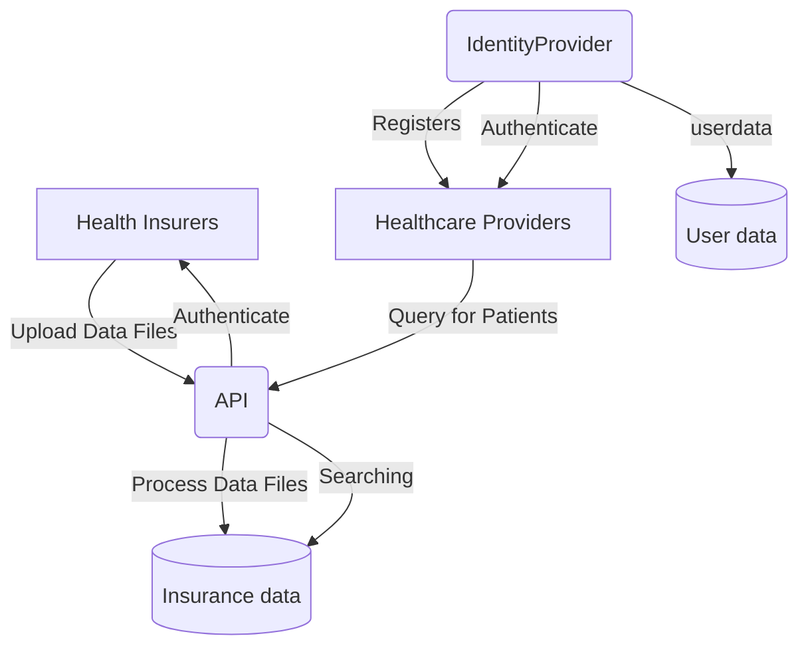

# The New System

Now that we have separated the Identity Provider responsibility from the system, we can update our earlier design to reflect these changes.

Below is an updated system diagram showing how data and authentication flow between components:

{: .highlight }
> API key verification remains a responsibility of the API.

## Messaging

The next step is to introduce messaging into our API. The data files that health insurers upload could be hundreds of megabytes in size. Using messaging will help us process these large files more efficiently and decouple the upload from the processing logic.

There are many frameworks and messaging infrastructure available for handling messaging, such as [RabbitMQ](https://www.rabbitmq.com/), [MassTransit](https://masstransit.io/),and [NServiceBus](https://particular.net/nservicebus). For this course, we will be using NServiceBus, however feel free to try out others. 