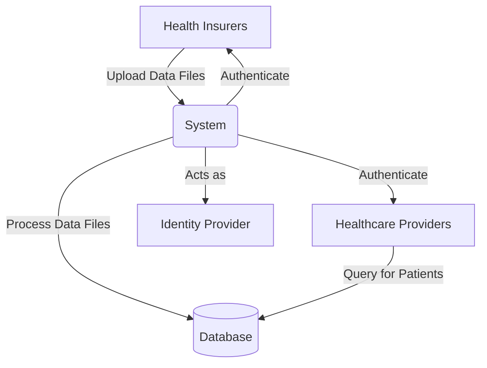

# The Solution

In this workshop, we will transform a monolithic application into a set of microservices based on the `InsuranceDetails.Api` solution. The `InsuranceDetails.Api` is a very simplified version of the COV solution used in the Dutch healthcare sector. COV stands for **Controle op Verzekeringsgegevens** (Insurance Data Check). In the real-world COV solution, health insurers upload their insurance data, and healthcare providers use the system to check the insurance status of their patients.

## The InsuranceDetails.Api

The current system provides the following capabilities:

- Create user accounts and login via JSON Web Tokens (JWT), allowing secure access to the system.
- Create, update, read, and delete Health Insurers, so the system can manage which insurers are available.
- Authenticate Health Insurers through the `X-API-KEY` header, ensuring only authorized insurers can upload data.
- Upload and process large data files containing health insurance data, which are then stored in the database.
- Enable users (such as healthcare providers) to query health insurance data based on a patient's BSN (Burgerservicenummer), the unique Dutch citizen service number.

All data is stored in a single database, and all functionality is handled by one application. This means the system is responsible for authentication, data processing, storage, and querying. The following diagram shows the current architecture:

## Goal of the Workshop

Can you identify some problems with this architecture?

The current system has too many responsibilities: it processes large data files, acts as an identity provider, handles searching, and manages (audit) logging. This "all-in-one" approach makes the system complex, difficult to scale, and harder to maintain. If one part fails or needs to be updated, it can impact the entire application. It also makes it challenging to introduce new features or scale specific parts of the system independently.

The goal of the workshop is to break up this monolithic system into smaller, focused microservices. Each microservice will handle a specific responsibility, such as authentication, data processing, or querying. We will also introduce messaging between services to make the solution more robust, scalable, and resilient to failures.

The microservices will be integrated using **.NET Aspire**.

### What is .NET Aspire?

.NET Aspire is a cloud-ready stack for building, running, and orchestrating distributed applications with .NET. It provides tools for service discovery, configuration, health checks, and seamless local development. With .NET Aspire, you can easily connect your microservices and supporting infrastructure, making your solution more maintainable, scalable, and production-ready. Aspire helps you focus on building business logic while taking care of the complexities of distributed systems.