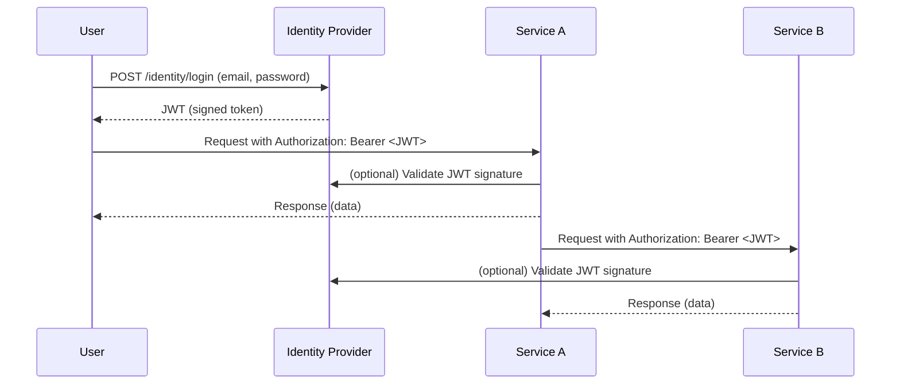

# JSON Web Token (JWT)

A **JSON Web Token (JWT)** is an open standard ([RFC 7519](https://datatracker.ietf.org/doc/html/rfc7519)) for securely transmitting information between parties as a JSON object. JWTs are widely used for authentication and authorization in modern web applications, especially in microservices architectures.

## Structure of a JWT

A JWT consists of three parts, separated by dots (`.`):

1. **Header** – Contains metadata about the token, such as the signing algorithm.
2. **Payload** – Contains the claims, which are statements about an entity (typically, the user) and additional data.
3. **Signature** – Used to verify that the token has not been altered.

Example:
```
eyJhbGciOiJIUzI1NiIsInR5cCI6IkpXVCJ9.
eyJodHRwOi8vc2NoZW1hcy54bWxzb2FwLm9yZy93cy8yMDA1LzA1L2lkZW50aXR5L2NsYWltcy9lbWFpbGFkZHJlc3MiOiJlbWFpbC5lbWFpbEBleGFtcGxlLmNvbSIsImh0dHA6Ly9zY2hlbWFzLm1pY3Jvc29mdC5jb20vd3MvMjAwOC8wNi9pZGVudGl0eS9jbGFpbXMvcm9sZSI6InVzZXIiLCJodHRwOi8vc2NoZW1hcy54bWxzb2FwLm9yZy93cy8yMDA1LzA1L2lkZW50aXR5L2NsYWltcy9uYW1laWRlbnRpZmllciI6IjIiLCJleHAiOjE3NDc4NDY5NDEsImlzcyI6ImxvY2FsaG9zdCIsImF1ZCI6IkFwaSJ9.
i8gckI8JCbohip-I1ouG2DV7gHz3hBS6iGRwUKjgoEc
```
- **Header**: `eyJhbGciOiJIUzI1NiIsInR5cCI6IkpXVCJ9`
- **Payload**: `eyJodHRwOi8vc2NoZW1hcy54bWxzb2FwLm9yZy93cy8yMDA1LzA1L2lkZW50aXR5L2NsYWltcy9lbWFpbGFkZHJlc3MiOiJlbWFpbC5lbWFpbEBleGFtcGxlLmNvbSIsImh0dHA6Ly9zY2hlbWFzLm1pY3Jvc29mdC5jb20vd3MvMjAwOC8wNi9pZGVudGl0eS9jbGFpbXMvcm9sZSI6InVzZXIiLCJodHRwOi8vc2NoZW1hcy54bWxzb2FwLm9yZy93cy8yMDA1LzA1L2lkZW50aXR5L2NsYWltcy9uYW1laWRlbnRpZmllciI6IjIiLCJleHAiOjE3NDc4NDY5NDEsImlzcyI6ImxvY2FsaG9zdCIsImF1ZCI6IkFwaSJ9`
- **Signature**: `I1ouG2DV7gHz3hBS6iGRwUKjgoEc`

## Payload

The **payload** is the second part of a JWT and contains the "claims." Claims are statements about an entity (typically, the user) and additional data. The payload is a JSON object that can include any information the issuer wants to transmit, but it is most commonly used to convey user identity and authorization details.

Some of the most common standard claims include:

- **sub** (Subject): The unique identifier for the user or entity the token refers to.
- **iss** (Issuer): Identifies the principal that issued the JWT.
- **aud** (Audience): Identifies the recipients that the JWT is intended for.
- **exp** (Expiration Time): The time after which the JWT expires and is no longer valid.
- **iat** (Issued At): The time at which the JWT was issued.
- **nbf** (Not Before): The time before which the JWT must not be accepted for processing.
- **email**: The user's email address (often included for convenience).
- **role**: The user's role or permissions within the system.

Custom claims can also be added to the payload to include application-specific information, such as user preferences or organization IDs.

{: .note }
> The payload is only base64url-encoded and not encrypted, so sensitive information should not be placed in the payload unless the JWT is encrypted.

## Signature

The signature ensures the integrity and authenticity of the token. It is created by encoding the header and payload, then signing them using a secret key (with HMAC) or a private key (with RSA/ECDSA). When a service receives a JWT, it can verify the signature to confirm that the token was issued by a trusted source and has not been tampered with.

{: .important }
> For simplicity, this workshop uses a secret stored in the `appsettings`. Please **do not** do this is the real world. Secrets typically come from secure storage services like [Microsoft Azure KeyVault](https://azure.microsoft.com/en-us/products/key-vault/) or [AWS Secrets Manager](https://aws.amazon.com/secrets-manager/).

## Usecases

JWTs are primarily used for:

- **Authentication**: After a user logs in, a JWT is issued and sent to the client. The client includes this token in subsequent requests to prove their identity.
- **Authorization**: Services can check the claims in the JWT (such as user roles or permissions) to determine what actions the user is allowed to perform.
- **Information Exchange**: JWTs can securely transmit information between parties, since the data is signed and optionally encrypted.

## JWTs vs. Session Authentication in Microservices

Traditional session authentication stores user session data on the server, often in memory or a database. This approach has limitations in a microservices architecture:

- **Scalability**: Sessions require shared storage or sticky sessions, making it harder to scale horizontally.
- **Decentralization**: Each microservice would need access to the session store, increasing complexity.
- **Statelessness**: Microservices benefit from stateless communication. JWTs are self-contained and do not require server-side storage.

**JWT Advantages in Microservices:**

- **Stateless**: All necessary information is in the token, so services do not need to store session data.
- **Decentralized Verification**: Any service with the signing key can verify the token.
- **Scalable**: No need for a central session store; tokens can be used across services and instances.

For these reasons, JWTs are a better fit for authentication and authorization in distributed, microservices-based systems.

Below is a Mermaid sequence diagram showing how services use JWT and the Identity Provider for authentication:



**Explanation:**
- The user logs in with their credentials at the Identity Provider and receives a JWT.
- The user includes the JWT in the Authorization header when making requests to Service A.
- Service A verifies the JWT (either locally or by contacting the Identity Provider).
- Service A can also use the JWT to call Service B, which also verifies the JWT.
- No session state is stored on the services; the JWT contains all necessary claims.