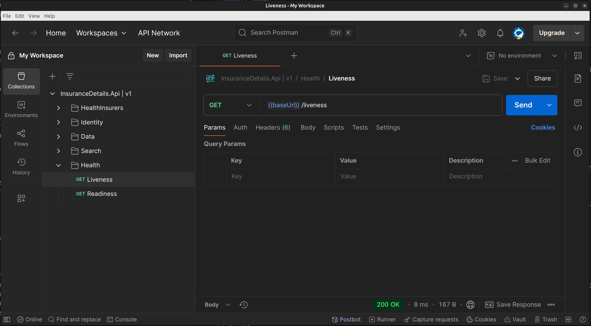

# Let's give it a go

Now that everything is set up, let's run the application using Docker and verify that it's working.

## 1. Start the application with Docker

Open your terminal and run the following command in the project root directory:

```bash
docker compose up --build --force-recreate
```

This command will build the Docker images (if needed) and start all the required containers for the application.

## 2. Import the Postman collection

In the `docs` folder, you'll find a Postman collection file. Import this file into Postman:

1. Open Postman.
2. Click **Import**.
3. Select the collection file from the `docs` folder.



## 3. Check the Health endpoint

After importing, locate the **Health** request in the collection. Run this request to check if the application is running correctly. You should receive a response indicating the service is healthy.

If you see a healthy response, your application is up and running in Docker!