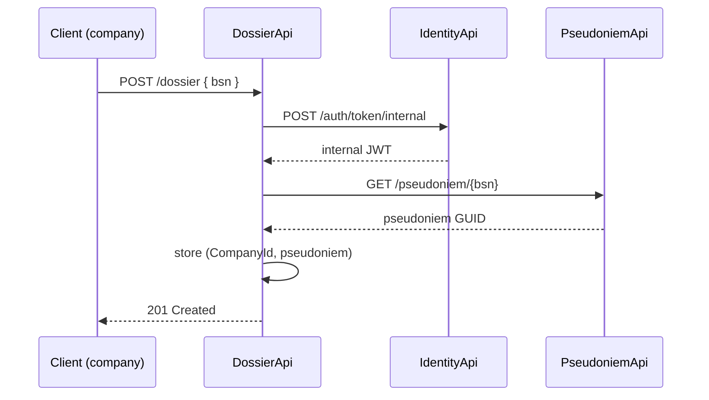

# Dossier API

The **DossierApi** is the core business service. It manages healthcare company registrations and patient consent dossiers.

## Company registration

```
POST /company/register
Body: { "companyName": "Your Company Name" }
```

No authentication required. Returns the new company's `CompanyId` (a GUID). Store this — it is needed to obtain a company token from IdentityApi.

In Bruno, open **Dossier → RegisterCompany**. The post-response script automatically saves `company_id` and `company_name` to the environment.

## Creating a dossier

```
POST /dossier
Authorization: Bearer <company_token>
Body: { "bsn": "123456780" }
```

A healthcare company creates a dossier for a patient by providing the patient's BSN. The DossierApi **never stores the BSN itself**. Instead it:

1. Requests an `Internal` token from IdentityApi (`POST /auth/token/internal`, cached for 10 minutes)
2. Calls PseudoniemApi (`GET /pseudoniem/{bsn}`) with that token to obtain the pseudoniem GUID
3. Stores the dossier as `(CompanyId, pseudoniem)` — no BSN in the database



Returns `201 Created` on success, or `200 OK` if the dossier already exists (no conflict error).

## Checking consent

```
GET /dossier/{bsn}/permission
Authorization: Bearer <company_token>
```

Returns whether the patient has approved access for the calling company:

- `200 OK` if the patient has approved sharing for the calling company.
- `403 Forbidden` if no dossier exists, or the patient has not yet approved.

## Deleting a dossier

```
DELETE /dossier/{bsn}
Authorization: Bearer <company_token>
```

Removes the dossier for the calling company and the given patient. Returns `204 No Content` if deleted, `404 Not Found` if no dossier existed.

## Next: [Patient Website](Search)