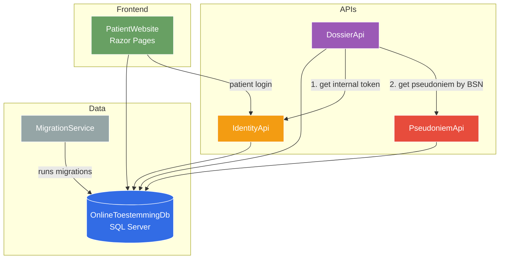

# The Solution

**Online Toestemming** (Online Consent) is a healthcare consent platform. Patients can log in and decide if healthcare companies may share records. Healthcare companies can register themselves and create dossiers for patients.

## The privacy challenge

Dutch law treats a patient's BSN (Burger Service Nummer — citizen service number) as highly sensitive personal data. It must never be stored or passed between services unnecessarily. The platform solves this with **pseudonymisation**: the BSN is converted into a stable, opaque GUID (a *pseudoniem*) at the earliest possible point, and only that GUID flows between services.

## Architecture

## Services at a glance

| Service | Responsibility | External port |
|---------|---------------|---------------|
| **IdentityApi** | Issues JWT tokens for patients, companies, and internal service calls |
| **PseudoniemApi** | Translates BSN → pseudonymous GUID; callable only with an `Internal` JWT |
| **DossierApi** | Manages company registrations and patient consent dossiers |
| **PatientWebsite** | Patient-facing Razor Pages UI; the only publicly reachable service |
| **MigrationService** | One-shot EF Core migration runner; exits after completion |

## What you will explore

1. Start the whole system with one Docker Compose command
2. Walk through each service using the **Bruno** API collection
3. Understand how JWT tokens, pseudonymisation, and service-to-service authentication work together

Ready? [Lets give it a go](LetsGiveItAGo) .